# 计算机网络实验 3

    傅申 PB20000051

## 2. A first look at the captured trace

文档中给出的包截图如下

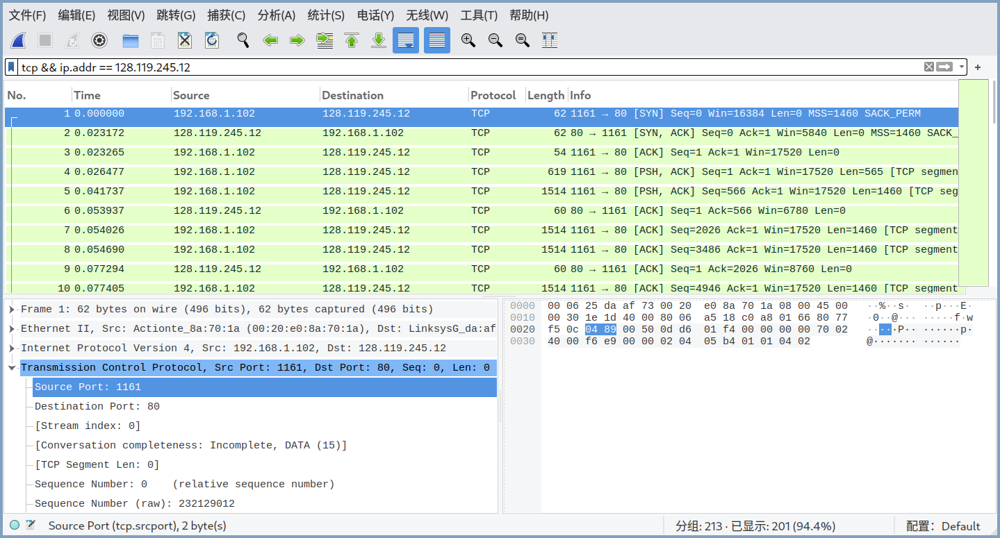

1. 客户计算机使用的 IP 地址为 `192.168.0.102`, 端口号为 `1161`.
2. [gaia.cs.umass.edu](http://gaia.cs.umass.edu) 的 IP 地址为 `128.119.245.12`, 端口号为 `80`.
3. 我的客户计算机使用的 IP 地址为 `192.168.84.1`, 端口号为 `36050`.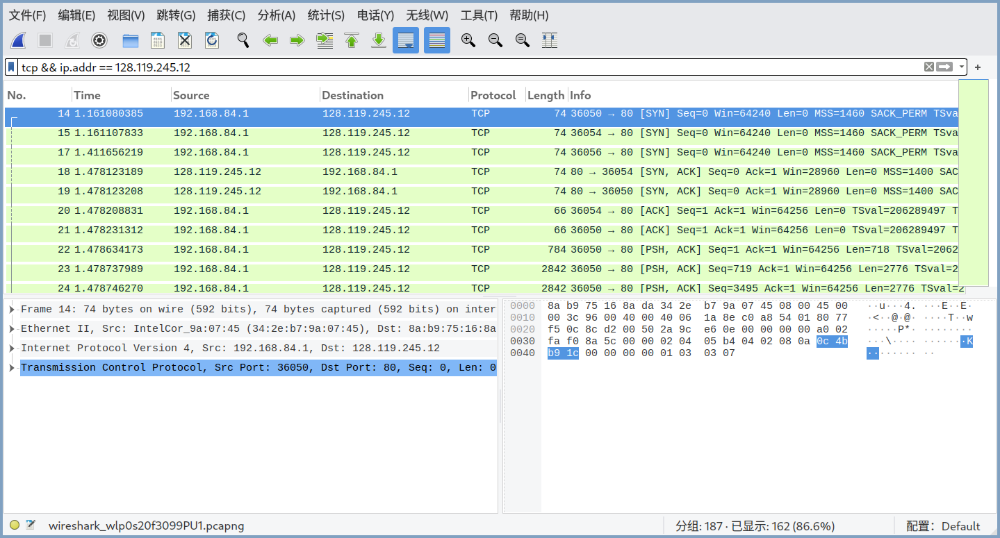

## 3. TCP Basics

使用提供的包

4. 序号为 `0`; Flags 字段设为 `0x002` 表明它是 SYN 报文段.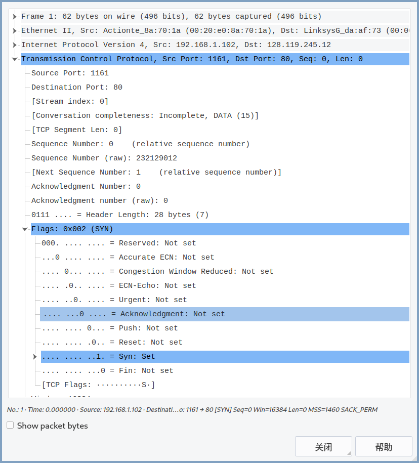

5. 序号为 `0`; Acknowledgement 字段为 `1`; Acknowledgement 字段的值是由客户发出的 SYN 报文序号加 1 得到; Flags 字段被设为了 `0x012` 表明它是 SYNACK 报文.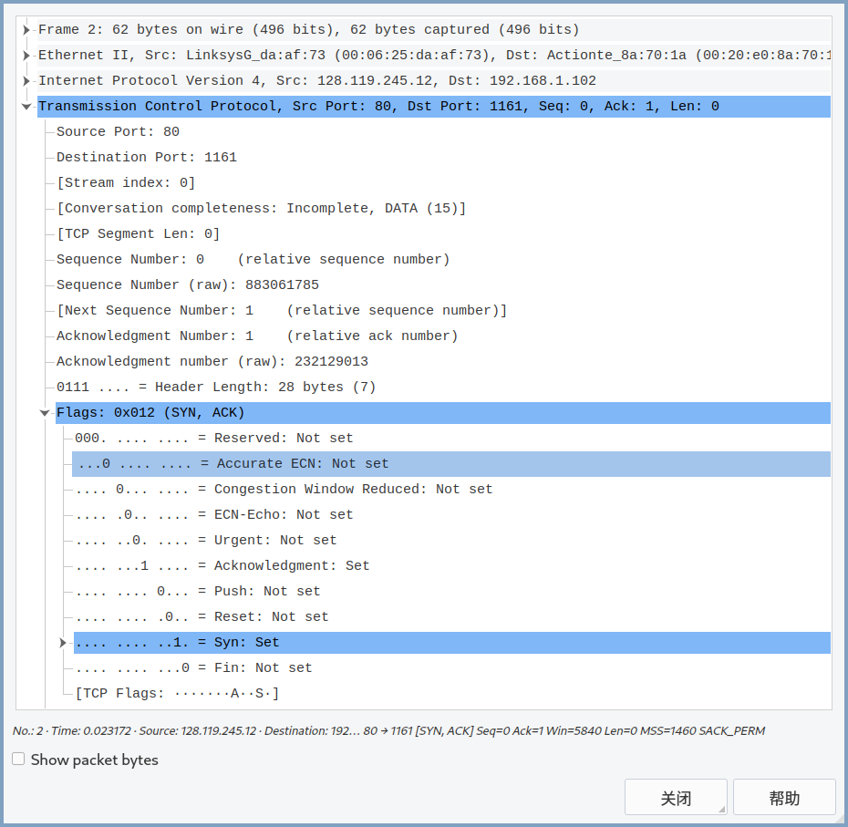

6. 序号为 `1`.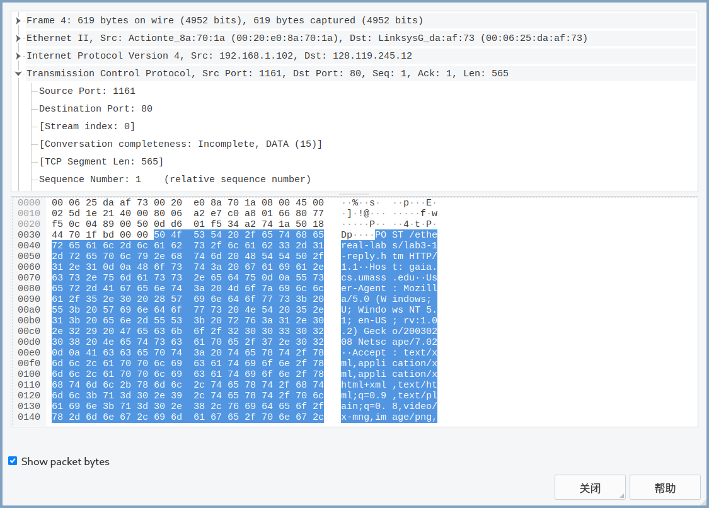

7. 如下表所示 (时间单位为秒), 这 6 个报文分别对应编号为 4, 5, 7, 8, 10, 11 的包, 其 ACK 报文分别对应编号为 6, 9, 12, 14, 15, 16 的包. 
   |        | 序号 | 报文发送时间 | ACK 接收时间 |   RTT    | 接收到 ACK 报文后的  EstimatedRTT |
   | :----: | :--: | :----------: | :----------: | :------: | :----------------------------------: |
   | 报文 1 |  1   |   0.026477   |   0.053937   | 0.027460 |               0.027460               |
   | 报文 2 | 566  |   0.041737   |   0.077294   | 0.035557 |               0.028472               |
   | 报文 3 | 2026 |   0.054026   |   0.124085   | 0.070059 |               0.033670               |
   | 报文 4 | 3486 |   0.054690   |   0.169118   | 0.114428 |               0.043765               |
   | 报文 5 | 4946 |   0.077405   |   0.217299   | 0.139894 |               0.055781               |
   | 报文 6 | 6406 |   0.078157   |   0.267802   | 0.189645 |               0.072514               |

   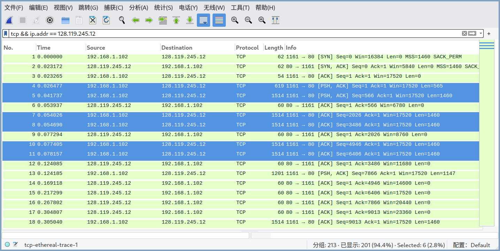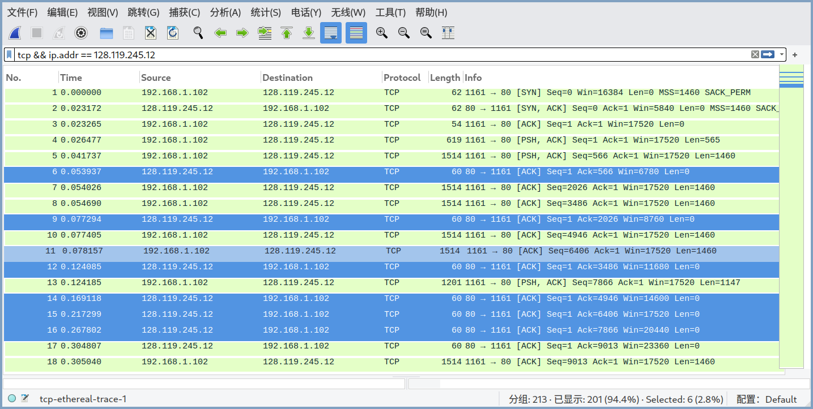

8. 依次为 `565`, `1460`, `1460`, `1460`, `1460`, `1460` 字节.
9. 最小可用缓冲区空间为 `5840` 字节 (即第一个 ACK 报文中的 Calculated window size); 接收方的缓冲区空间没有影响到发送者.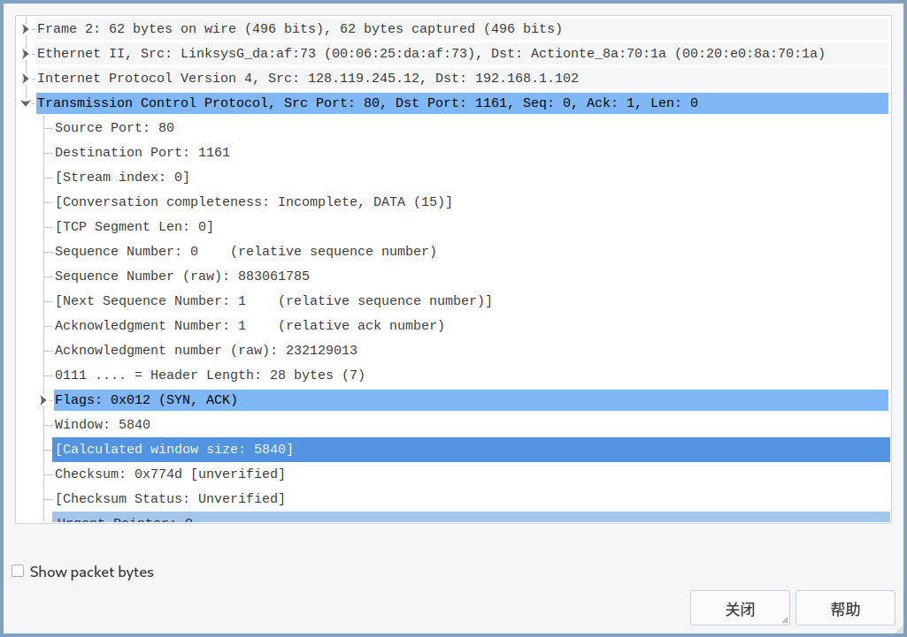
10. 没有重发的报文, 通过观察时间序列图 (Stevens) 可以发现报文序号一直是增加的, 如果有重发的报文, 则序号会在某一处减少.
    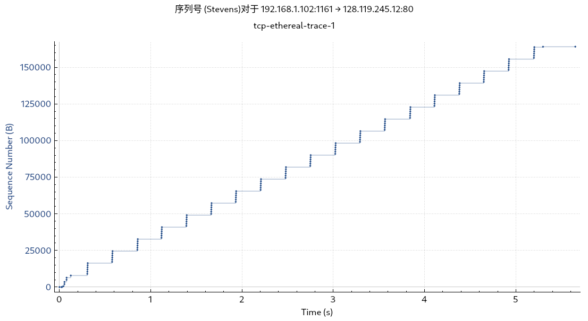
11. 接收方通常会确认 `1460` 字节数据; 可以找到发送累积 ACK 的情况, 比如编号为 60, Ack=37969 的 ACK 报文, 上一个 ACK 报文 (编号 59) 的 Ack=35049, 相差 2920=1460*2.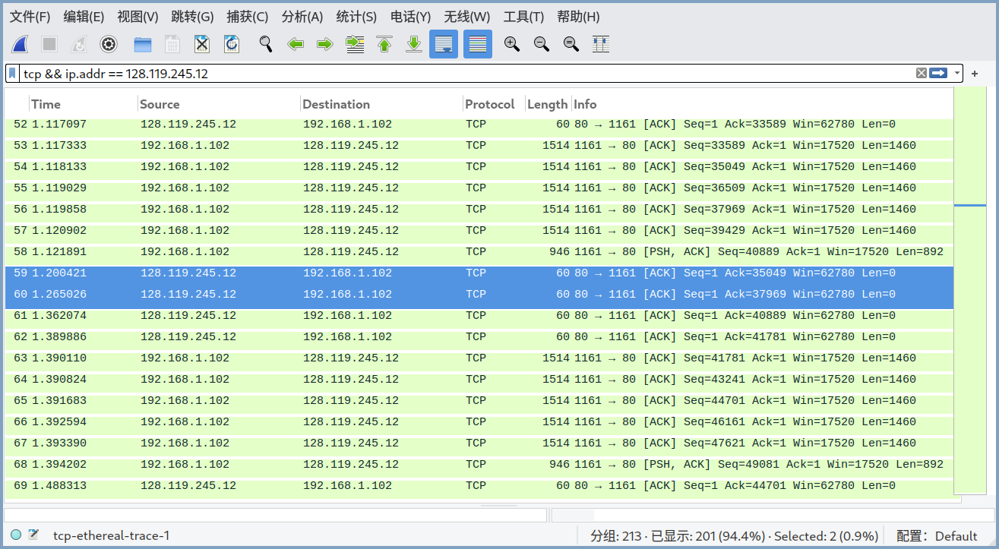
12. 计算整个连接中的平均吞吐量, 观察第一个 TCP 报文 (编号为 1) 的序号为 1, 发送时间为 0.026477, 传输过程最后一个 ACK 报文 (编号为 202) 的 Ack 号为 164091, 接收时间为 5.455830. 因此整个传输过程发送了 164090 字节的数据, 使用的时间为 5.429353s, 平均吞吐量为 30.22275KBps.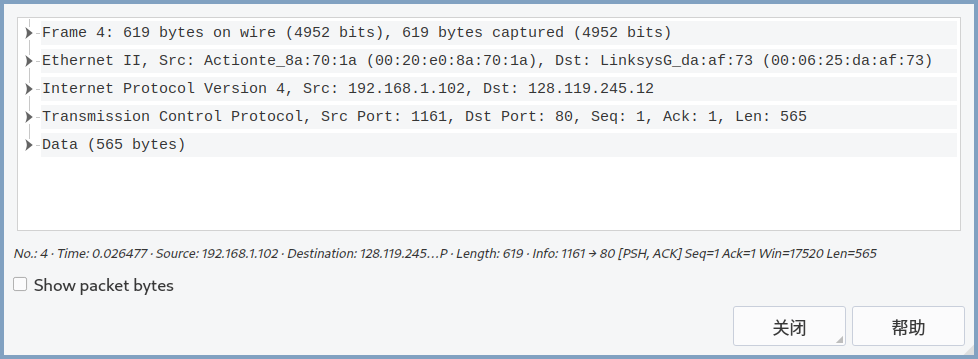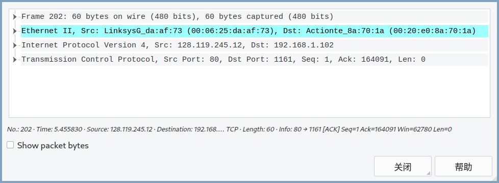

## 4. TCP congestion control in action 

13. 时间序列图如下, 慢启动从大约 0s 时刻开始到大约 0.1s 时刻结束, 在大约 0.3s 时刻进入拥塞避免阶段. 其与理想化的 TCP 行为不同的是在慢启动后每次都发送 6 个报文, 而不是线性增长.

14. 时间序列图如下, 慢启动从大约 0.32s 时刻开始到大约 1.1s 时刻结束, 大约 1.3s 时刻进入拥塞避免阶段.

    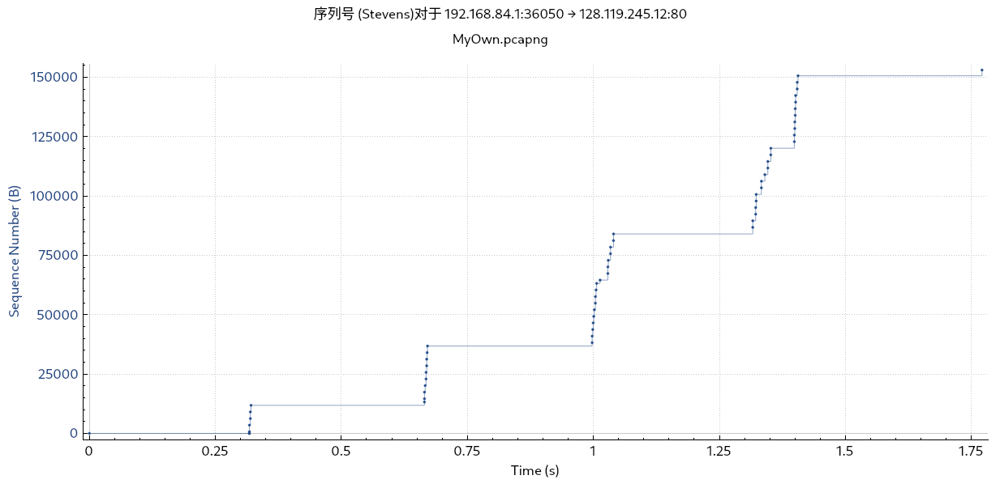