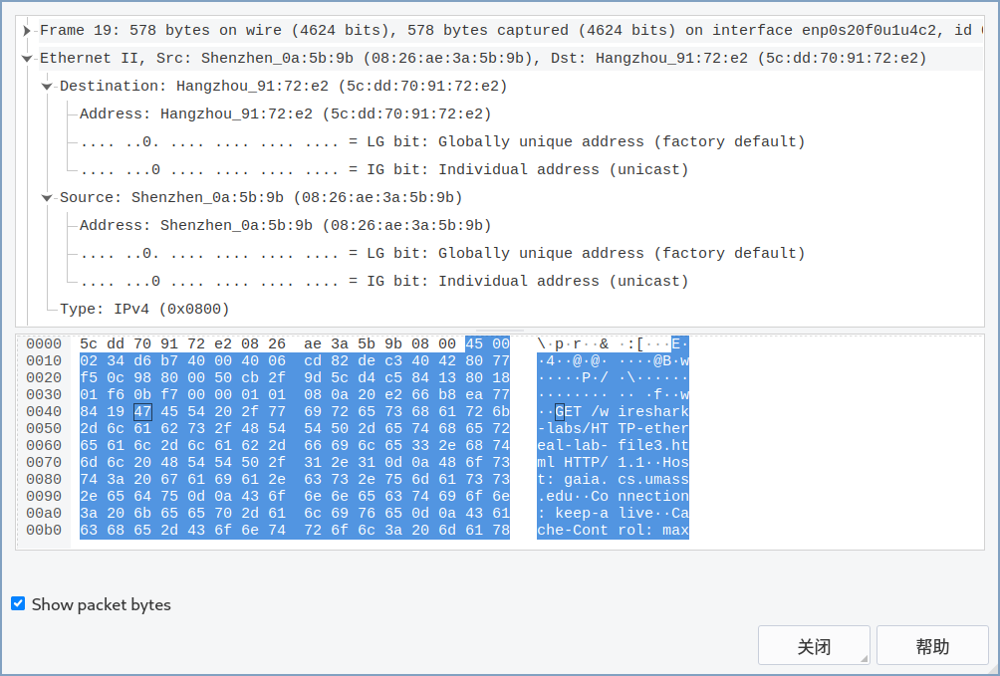
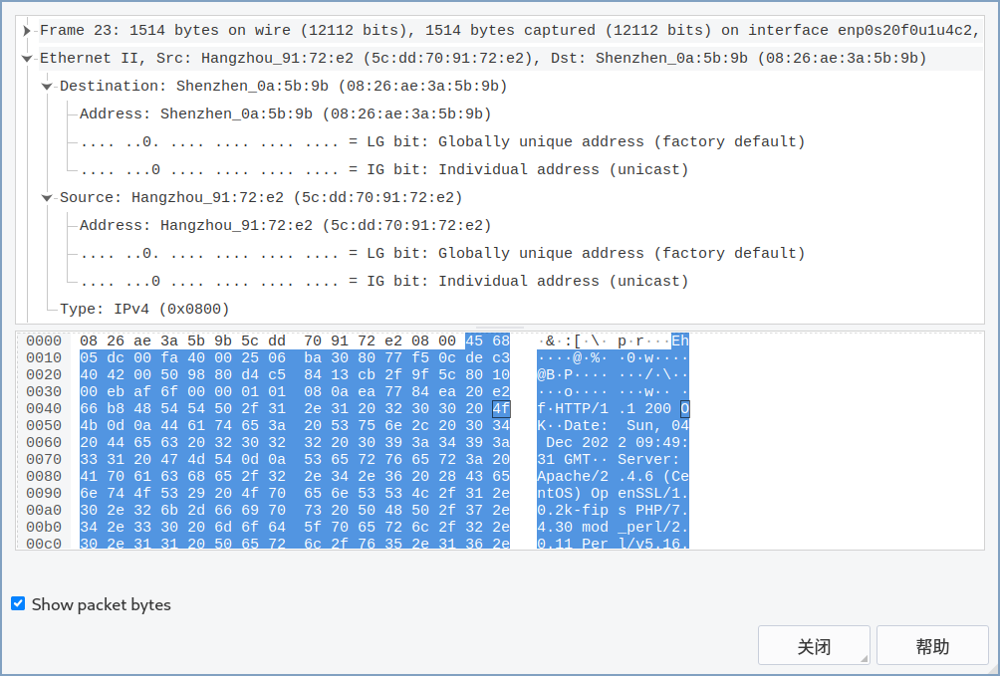
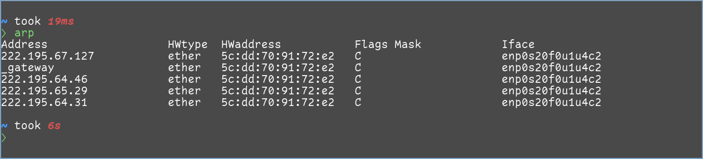
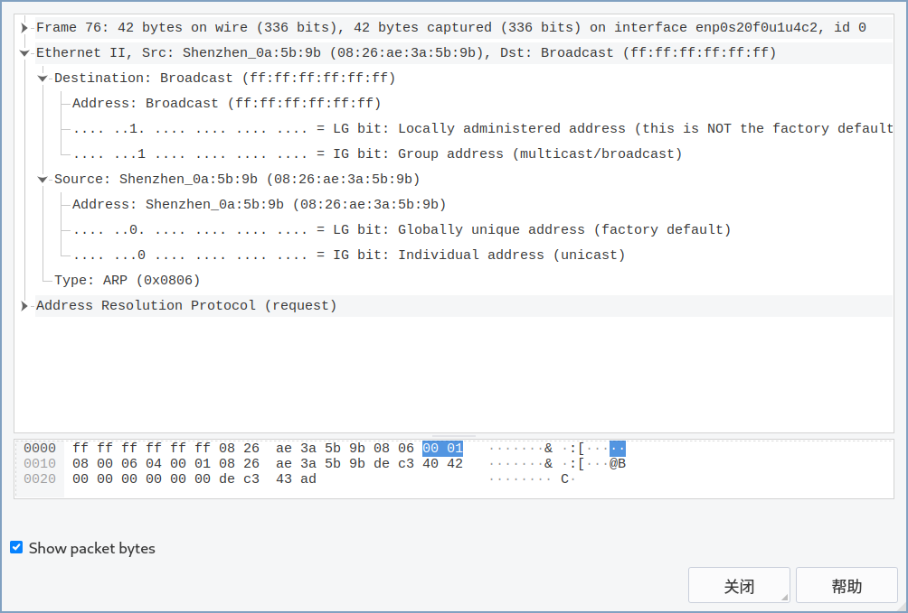
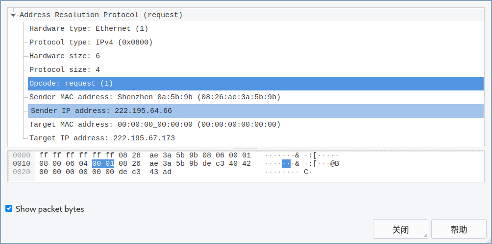
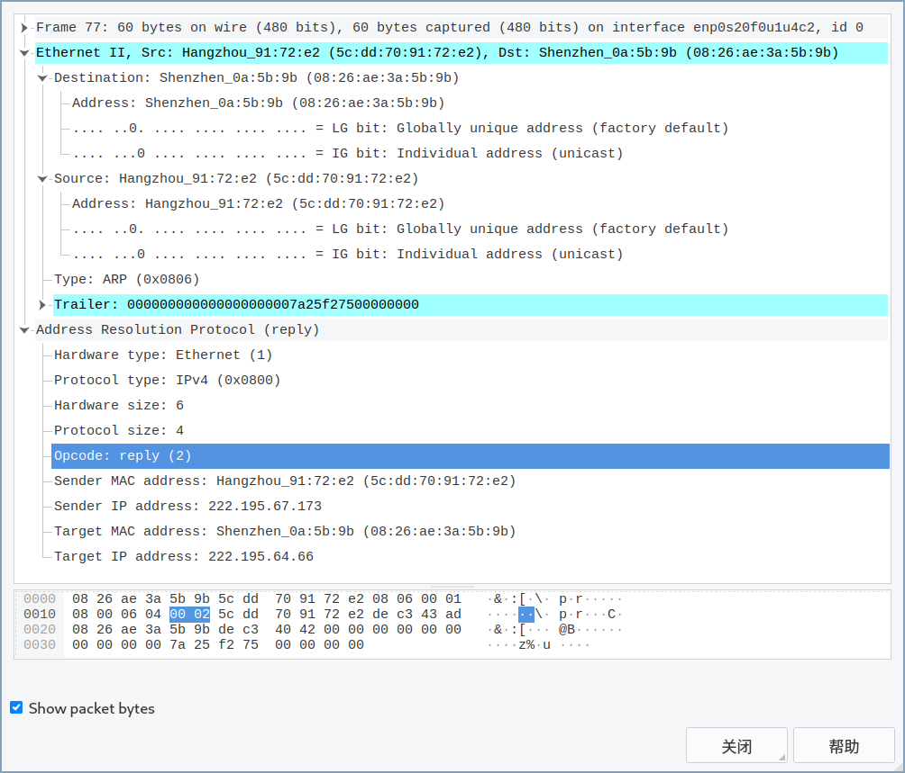
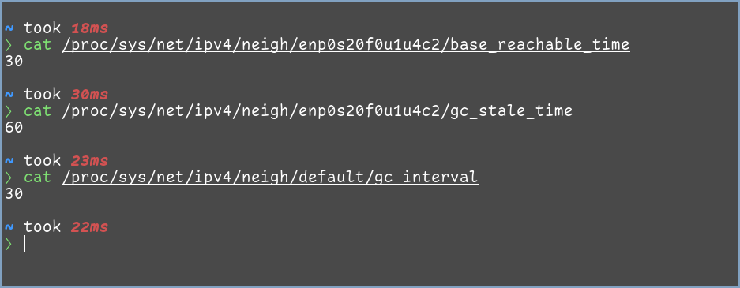

# 计算机网络实验 6

    傅申 PB20000051

## 1. Capturing and analyzing Ethernet frames

1. 我的电脑的地址为 `08:26:ae:3a:5b:9b`.
2. 目的地址为 `5c:dd:70:91:72:e2`, 它不是 gaia.cs.umass.edu 的地址. 这个地址属于我的主机连接到的路由器的接口.
3. 类型字段为 `0x0800`, 它对应 IP 协议.

4. "GET" 中的 "G" 是报文中的第 67 字节.

5. 源地址为 `5c:dd:70:91:72:e2`, 它不是我的电脑地址或 gaia.cs.umass.edu 的地址. 这个地址属于我的主机连接到的路由器的接口.
6. 目的地址为 `08:26:ae:3a:5b:9b`, 它是我的电脑地址.
7. 类型字段为 `0x0800`, 它对应 IP 协议.
8. "OK" 中的 "O" 是报文中的第 80 字节.

## 2. The Address Resolution Protocol

9. ARP 缓存内容如上图. `Address` 栏为 IP 地址, `HWtype` 为硬件类型, `HWaddress` 为 MAC 地址, `Flags Mask` 指示表项的来源 (`C`: dynamically learned by arp protocol; `M`: manually entered/added in the memory; `P`: publish), `Iface` 为网络接口.

10. 源地址为 `08:26:ae:3a:5b:9b`, 目的地址为 `ff:ff:ff:ff:ff:ff`.
11. 类型字段为 `0x0806`, 它对应 ARP 协议.

12. a. opcode 开始于第 21 字节.

    b. opcode 字段的值为 `0x0001`.

    c. ARP 报文包含了发送方的 IP 地址.

    d. "问题" 出现在 Target MAC address, 它被设为了 `00:00:00:00:00:00`.

13. a. opcode 开始于第 21 字节.

    b. opcode 字段的值为 `0x0002`.

    c. "回答" 出现在 Sender MAC address.

14. 源地址为 `5c:dd:70:91:72:e2`, 目的地址为 `08:26:ae:3a:5b:9b`.
15. 因为查询报文是在广播帧中发送的, 子网中所有主机都能收到, 但是响应报文只有发送查询报文的主机能收到, 而运行 Wireshark 的主机不是发送查询报文的主机.

## Extra Credit

> 下面的部分内容引用自 [StackOverflow](https://stackoverflow.com/a/15511117).

EX-2. 我使用的操作系统为 Manjaro Linux, 一个新的表项会被设置一个随机的 TTL ($\frac{\texttt{base\_reachable\_time}}{2}$ 和 $\frac{3 \times \texttt{base\_reachable\_time}}{2}$ 之间), 当超过 TTL 后, 表项会被标记为 `STALE` 状态并失效. 如果一个表项在 `gc_stale_time` 内处于 `STALE` 状态且没有被使用, 则其会被标记为可以删除, 并且会在下次 garbage collector 运行时被删除 (通常在 `gc_interval` 秒之后). 

由上图可知, 表项会在 $(15\sim 45) + 60 + 30$ 秒, 也就是 105 ~ 135 秒内被删除.