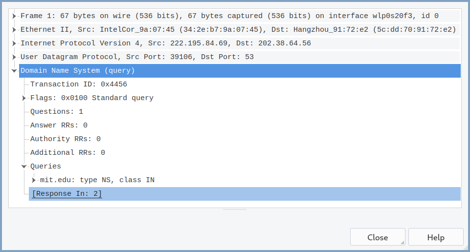

# 计算机网络实验 3

    傅申 PB20000051

## 1. nslookup

1. 查询到清华大学网络服务器的 IP 地址为 `166.111.4.100` (IPv4) 和 `2402:f000:1:404:166:111:4:100` (IPv6).
2. [UCL](https://www.ucl.ac.uk) 的权威 DNS 服务器为 `ns1.cloudflare.com`.
3. (cloudflare 的 DNS 服务器查不到, 换成科大的了) Yahoo! 邮件的 IP 地址有 `69.147.80.12`, `69.147.80.15`, `2001:4998:64:800::6001` 和 `2001:4998:64:800::6000`.

## 3. Tracing DNS with Wireshark

### Problem 4 - 10

打印的文件截图见 [Printouts](#Printouts).

4. UDP.

5. 查询报文的目的端口为 `53`, 回答报文的源端口为 `53`.

6. DNS 查询报文送到了 `202.38.64.17`, 与本地 DNS 服务器的 IP 地址相同.

   

7. 以编号为 1 的查询报文为例: 类型为 `A`, 不包含回答.

   

8. 以编号为 3 的回答报文为例: 有 3 个回答, 第一个回答中有别名, 类别, TTL 和规范主机名, 后两个回答中有主机名, 类别, TTL 和 IP 地址.

   

9. 以编号为 6 的 TCP SYN 包为例: 目的 IP 地址与 DNS 回答报文中的相同, 均为 `104.16.44.99`.

   

10. 没有, 因为网页中的图像都在 www.ietf.org 中.

### Problem 11 - 15

11. 查询报文的目的端口为 `53`, 回答报文的源端口为 `53`.

12. DNS 查询报文送到了 `202.38.64.56`, 与本地 DNS 服务器的 IP 地址相同.

13. 类型为 `A`, 不包含回答.

    

14. 有 3 个回答, 前两个回答中有别名, 类别, TTL 和规范主机名, 最后一个回答中有主机名, 类别, TTL 和 IP 地址.

    

15. 

### Problem 16 - 19

16. DNS 查询报文送到了 `202.38.64.56`, 与本地 DNS 服务器的 IP 地址相同.

17. 类型为 `NS`, 不包含回答.

    

18. 回答报文提供了 `use5.akam.net`, `asia1.akam.net`, `use2.akam.net`, `ns1-37.akam.net`, `usw2.akam.net`, `eur5.akam.net`, `ns1-173.akam.net`, `asia2.akam.net` 共 8 个名称服务器, 没有提供 IP 地址.

    

19. 

### Problem 20 - 23

改用 Google 的 DNS 解析服务 [dns.google.com](https://dns.google.com).

20. DNS 查询报文送到了 `8.8.4.4`, 与本地 DNS 服务器的 IP 地址不同, 它是 Google DNS 解析服务的地址.

21. 以编号为 1 的查询报文为例: 类型为 `A`, 不包含回答.

    

22. 以编号为 2 的回答报文为例: 有 1 个回答, 包含了有主机名, 类别, TTL 和 IP 地址.

    

23. 

## Printouts

